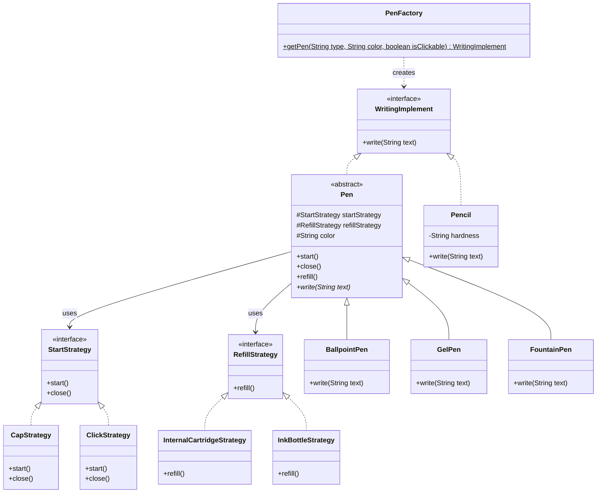

# Pen Design System

This repository contains the Object-Oriented Design implementation of a Pen system. It handles various pen types such as `BallpointPen`, `GelPen`, and `FountainPen` and allows variations in start mechanisms (Cap vs. Click) and refill mechanisms (Cartridge vs. Ink Bottle).

## Design Decisions

1. **Strategy Pattern:** Instead of hardcoding how a pen opens or is refilled, we injected `StartStrategy` and `RefillStrategy`. This avoids modifying existing classes whenever a new mechanism (like a twist-to-open pen) is added, adhering perfectly to the Open-Closed Principle (OCP).
2. **Interface Abstraction:** The `WritingImplement` interface allows extending the design to `Pencil` or other writing tools effortlessly. It follows the Liskov Substitution Principle (LSP).

## Mermaid Class Diagram

