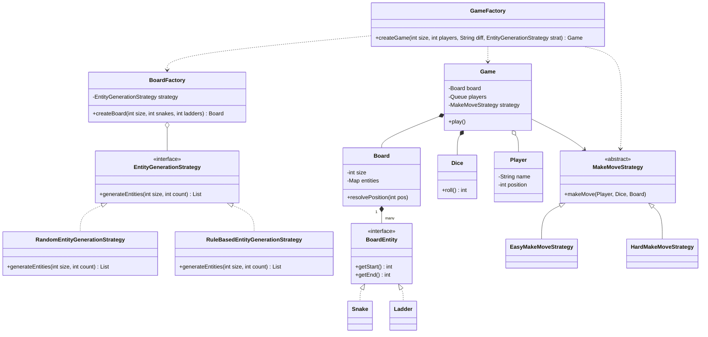

# Snake and Ladder Design System

This repository contains the Object-Oriented Design implementation of a Snake & Ladder game.

## Design Decisions
1. **Delegation over Implementation:** The `Game` class loop serves purely as a conductor, relying on composed structures to process rules.
2. **Strategy Pattern:** `MakeMoveStrategy` allows decoupling movement rules (like multiple 6s resetting) into `EasyMoveStrategy` or `HardMoveStrategy`.
3. **Factory Pattern:** `GameFactory` and `BoardFactory` abstract away the complex object wiring steps. Random entities are placed ensuring no cycles are created using the `EntityGenerationStrategy`.

## 📊 Visual UML Diagram (Snake & Ladder)

